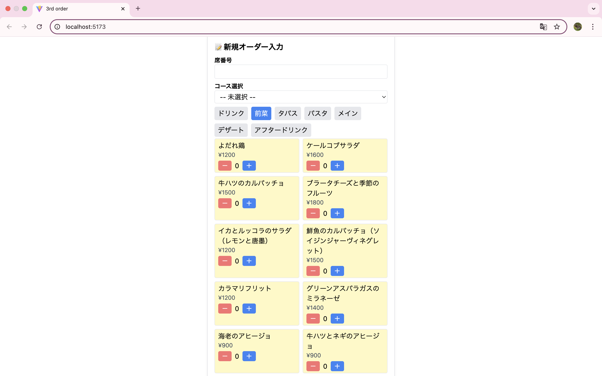

# easy-order-3rd_dining

🍽️ 飲食店のオーダー取りを効率化する、ハンディターミナル風のWebアプリケーションです。  
React + Tailwind CSS で構築し、オプション選択やコースタイマー通知など、現場での実用を意識した設計になっています。

🍽️ A handy web application for restaurant staff to quickly take table orders, track course meals, and notify the kitchen at the right timing.  
Built with **React** and **Tailwind CSS**, optimized for mobile and real-world use.

---

## ✨ 主な機能 / Features

- ✅ 席番号・メニュー・個数をタップで簡単入力 / Easy order input by tapping
- ✅ ドリンク等のオプション選択（例：コーヒーのHOT/ICE）/ Option selection (e.g., HOT/ICE)
- ✅ コース料理の進行に合わせたファイアータイマー通知 / Timer-based course progress notification
- ✅ オーダー内容の編集・保存 / Order editing and saving
- ✅ Tailwindによるモバイル向けUI / Mobile-friendly UI with Tailwind
- ✅ データはローカル保存（localStorage）/ Local data persistence

---

## 📸 スクリーンショット / Screenshots

  


---

## 🛠 技術スタック / Tech Stack

| 技術 / Tech | 内容 / Description |
|-------------|--------------------|
| Frontend    | React (Vite), JavaScript |
| UI          | Tailwind CSS |
| 状態管理     | useState, useEffect |
| 保存        | localStorage |
| その他      | Git, GitHub |

---

## 🚀 セットアップ方法 / Getting Started

```bash
git clone https://github.com/Yurin/easy-order-3rd_dining.git
cd easy-order-3rd_dining
npm install
npm run dev


```

## 📦 フォルダ構成
```
src/
├── App.jsx
├── components/
│   ├── OrderForm.jsx
│   └── TimerManager.jsx
├── data/
│   ├── menudata.js
│   └── courses.js
└── index.css

```

## 👩‍💻 作者
名前：Yuri Nakano

GitHub：Yurin

## 📝 ライセンス
MIT License